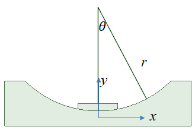

[首页](https://wwl.today)  [关于](https://wwl.today/about.html) 

# 摩擦摆隔震系统

[TOC]

最近接触到一种隔震方式叫**摩擦摆隔震系统（Friction Pendulum System）**。

## 1. 模型

其最简单的模型如下图所示：


建筑基座端部为一个滑块，可以在一个弧形槽里滑动。当发生地震时，滑块通过滑动来减轻建筑响应，通过摩擦耗散地震能量。同时由于重力作用，滑块具有回复力。弧形槽半径r，滑动面摩擦系数为$\mu$，滑块质量为$m_1$，$m_2$到$m_7$为建筑各层质量，$c_i、k_i$为各层刚度与阻尼系数。

## 2. 运动方程

首先，滑块水平、竖直方向坐标与转角之间的关系：
$$
x_1=rsin(\theta),
\dot{x}_1=rcos(\theta)\dot{\theta},
\ddot{x}_1=-rsin(\theta)\dot{\theta}^{2}+rcos(\theta)\ddot{\theta}\\
y_1=r-rcos(\theta),
\dot{y}_1=rsin(\theta)\dot{\theta},
\ddot{y}_1=rcos(\theta)\dot{\theta}^2+rsin(\theta)\ddot{\theta}
$$




在滑动状态下，取弧形槽对滑块的水平作用力为$F$，弧形槽对滑块的垂直作用力为$W$，其值分别为：
$$
m_1\ddot{x_1}+c_2(\dot{x_1}-\dot{x_2})+k_2(x_1-x_2)=F\\
W=\sum_{i=1}^{n} m_ig+\sum_{i=1}^{n} m_i\ddot{y_1}
$$
取弧形槽对滑块的切向作用力为$T$，弧形槽对滑块的径向作用力为$P$，其值分别为：
$$
T=Fcos(\theta)+Wsin(\theta)\\
P=Wcos(\theta)-Fsin(\theta)
$$
或者
$$
F=Tcos(\theta)-Psin(\theta)\\
W=Tsin(\theta)+Pcos(\theta)
$$
滑动状态下，根据库伦摩擦公式：
$$
T=-P\mu \cdot sgn(\dot\theta) 
$$
则有：
$$
W=P\mu sin(\theta)+Pcos(\theta)=P(\mu sin(\theta)+cos(\theta))\\
F=P\mu cos(\theta)-Psin(\theta)=P(\mu cos(\theta)-sin(\theta))\\
=\frac {W}{\mu sin(\theta)+cos(\theta)}(\mu cos(\theta)-sin(\theta))
$$
把方程1和方程6带入方程2，即可得到滑块的运动微分方程：
$$
\ddot \theta+\frac{A_2}{A_1}\dot{\theta}^2+\frac{A_3}{A_1}-\frac{1}{m_1rA_1}[k_2(rsin\theta-x_2)+c_2(r\dot{\theta}cos\theta-\dot{x_2})](\mu sgn(\dot{\theta})sin\theta-cos\theta)\\
=\frac{\ddot{a_g}}{rA_1}(\mu sgn(\dot \theta)sin\theta-cos\theta)
$$
其中,$sgn(\dot\theta)$为符号函数，用于描述摩擦力与运动方向的关系。而
$$
A_1=1+\frac{\sum_{i=2}^n m_i}{m_1}({\mu}sgn(\dot\theta)cos(\theta)+sin\theta)sin\theta
$$

$$
A_2=\mu sgn(\dot\theta)+\frac{\sum_{i=2}^n m_i}{m_1}(\mu sgn(\dot\theta)cos\theta+sin\theta)cos\theta
$$

$$
A_3=\frac{g}{r}\frac{\sum_{i=1}^n m_i}{m_1}(\mu sgn(\dot\theta)cos\theta+sin\theta)
$$

中间层的运动微分方程为：
$$
m_i\ddot{x_i}+k_i(x_i-x_{i-1})+k_{i+1}(x_i-x_{i+1})+c_i(\dot {x_i}-\dot x_{i-1})+c_{i+1}(\dot x_i-\dot x_{i+1})=-m_i\ddot{a_g}
$$
顶层质量点$m_n$的运动微分方程为：
$$
m_n\ddot x_n+k_n(x_n-x_{n-1})+c_n(\dot y_n-\dot y_{n-1})=-m_n\ddot a_g
$$
由方程7、11、12组成的方程组即为该摩擦摆隔震系统的微分方程组。

## 3. 状态转换

上述方程是建立在滑块滑动的情况下的，在运动过程中，当滑块受到的切向力小于滑动摩擦力时，即$T<P\mu$时，且滑块速度为0时，滑块则不会滑动，相当于固定基础，此时方程7将不存在。

## 4. 运动方程求解

求解该方程组的Matlab代码如下:

```matlab
function [ rt,rd,rv,ra,rrd] = solve_fps(floordata,r,u,dt,ag)
% *SOLVE_FPS 摩擦摆隔振系统求解函数*

% floordata：楼层参数,其格式如下，
%     {[m1],[k1],[c1]
%      [m1],[k1],[c1]
%      [m2],[k2],[c2]
%      ...
%      [mn],[kn],[cn]}
%
%     r：摩擦摆半径；
%     u：摩擦系数；
%     dt：地震时程采样时间间隔；
%     ag：地震时程数据，单位为g；
% 返回值：
% 	rt：时刻数组；
%	rd：响应位移时程；
%	rv：响应速度；
%	ra：响应加速度；
%	rrd：层间位移；

nfloor=size(floordata,1);   %楼层数
ag=ag*9.8;                  %乘以g
tg=0:dt:dt*length(ag)-dt;   %时间向量
m=floordata(:,1);           %m=各层质量
m=cell2mat(m);
k=floordata(2:end,2);       %k=各层刚度，
k=cell2mat(k);
k=[1;k];
k=k*1000;                   %原刚度单位为kN，固乘以1000；
c=floordata(2:end,3);       %c=各层阻尼系数
c=cell2mat(c);
c=[1;c];

m1=m(1);                    %滑块质量
M=sum(m(2:end));            %上层总质量

init=zeros(nfloor*2,1);     %初始值0
[rt,ry]=ode45(@wffc_fps,tg,init);   %龙格库塔法求解

rd=ry(:,1:2:2*nfloor);      %各层位移
rv=ry(:,2:2:2*nfloor);      %各层速度

%根据计算得到的位移、速度，带入方程，计算相对加速度响应
ra=zeros(length(rt),nfloor);
for tn=1:length(rt)
    dy=wffc_fps(rt(tn),ry(tn,:));
    ra(tn,:)=dy(2:2:2*nfloor);
end

ra(:,1)=r*cos(rd(:,1)).*ra(:,1)-r*sin(rd(:,1)).*rv(:,1).^2;
rv(:,1)=r*cos(rd(:,1)).*rv(:,1);
rd(:,1)=r*sin(rd(:,1));


% %相对加速度加上地面加速度，得到绝对加速度
for i=1:nfloor
    ra(:,i)=ra(:,i)+ag;
end

rrd=rd(:,2:end)-rd(:,1:end-1);
rrd=[rd(:,1),rrd];

    function dy=wffc_fps(t,y)
        % n 自由度系统微分方程组
        dy=zeros(nfloor*2,1);
        g=9.8;
        uy=interp1(tg,ag,t,'linear'); %根据线性插值，获取对应时间的地震加速度值

        % 中间参数
        sgn=sign(y(2));
        siny=sin(y(1));
        cosy=cos(y(1));
        A1=1+(M/m1)*(u*sgn*cosy+siny)*siny;
        A2=u*sgn+(M/m1)*(u*sgn*cosy+siny)*cosy;
        A3=(g/r)*((M+m1)/m1)*(u*sgn*cosy+siny);

        %微分方程组
        dy(1)=y(2);
        dy(2)=uy*(u*sgn*siny-cosy)/r/A1+(k(2)*(r*siny-y(3))+c(2)*(r*y(2)*cosy-y(4)))*(u*sgn*siny-cosy)/m1/r/A1-A3/A1-A2/A1*y(2)^2;

		%计算切向力与法向力，用于判断滑块是否滑动
        G=(m1+M)*g+r*M*(cosy*y(2)^2+siny*dy(2));
        P=-G*siny-(k(2)*(r*siny-y(3))+c(2)*(r*y(2)*cosy-y(4)))*cosy-m1*uy*cosy;
        N=G*cosy-(m1*uy+k(2)*(r*siny-y(3))+c(2)*(r*y(2)*cosy-y(4)))*siny+m1*r*y(2)^2;
        F=u*N;
        %如果滑块没有滑动，则直接设置其速度与加速度为0
        if abs(y(2))<1e-5&&abs(P)<=abs(F)
            dy(1)=0;
            dy(2)=0;
        end

		%如果仅有两层，则第2层就是顶层。
        if nfloor==2
            dy(3)=y(4);
            dy(4)=(-m(2)*uy-c(2)*(y(4)-r*y(2)*cosy)-k(2)*(y(3)-r*siny))/m(2);
        end
        
        if nfloor>2
            dy(3)=y(4);
            dy(4)=(-m(2)*uy-c(3)*(y(4)-y(6))-c(2)*(y(4)-r*y(2)*cosy)-k(3)*(y(3)-y(5))-k(2)*(y(3)-r*siny))/m(2);

            for fn=3:nfloor
                dy(fn*2-1)=y(fn*2);
                if fn==nfloor
                    dy(fn*2)=(-m(fn)*uy-c(fn)*(y(2*fn)-y(2*fn-2))-k(fn)*(y(2*fn-1)-y(2*fn-3)))/m(fn);
                else
                    dy(fn*2)=(-m(fn)*uy-c(fn+1)*(y(2*fn)-y(2*fn+2))-c(fn)*(y(2*fn)-y(2*fn-2))-k(fn+1)*(y(2*fn-1)-y(2*fn+1))-k(fn)*(y(2*fn-1)-y(2*fn-3)))/m(fn);
                end
            end
        end
    end
end
```

## 5. LS-DYNA 求解验证

为了验证上述求解的正确性，用DYNA做了一个小例子，进行时程分析。


如图所示，基座半径为1m，滑块质量186kg，摩擦系数为0.1。基础之上共有5层，每层质量都与基座相同。每层都用质量点表示，各层之间通过离散梁单元连接，梁单元使用材料模型为LINEAR_ELASTIC_DISCRETE_BEAM，设置其沿水平方向的刚度即横向刚度为186000N/m，阻尼系数为450，沿重力方向刚度取大三个数量级，阻尼系数也大两个数量级。

通过下面的对比可以看出，DYNA的计算结果几乎与MATLAB算出来的一致。

有几点可能的原因导致结算结果的轻微偏差：

1. MATLAB计算时，需要对进行滑块的状态转换，判断滑块不滑动的充要条件是，切向力小于滑动摩擦力且速度为0。为提高迭代速度，代码中取滑块速度小于1e-5时则取其速度为0，这里会导致轻微偏差；
2. 在DYNA中模拟摩擦摆最关键的是滑块与基座之间的接触设置。由于有限元软件中接触不可避免的产生接触面间的相互渗透，当滑块与基座的节点在计算过程中渗透量越大时，其摩擦系数并不是理想的设置的摩擦系数，导致较大偏差。为使仿真过程中的等效摩擦系数是期望的值，需要尽可能提高接触界面间的刚度，使其渗透减小。

### 5.1位移对比


### 5.2 加速度对比


## 6. 简单的多层结构FPS计算程序

根据上述内容，可编写如下程序，加入了没有隔振系统的计算结果，输出任意层的位移、加速度、层间位移等，可以对比隔振效果。


