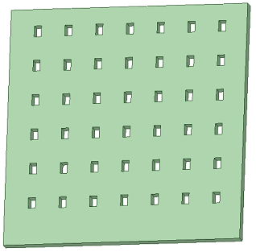
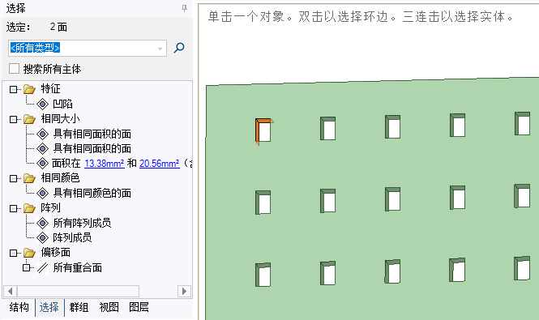
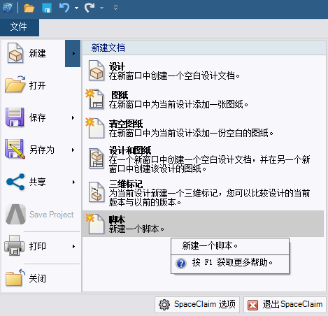
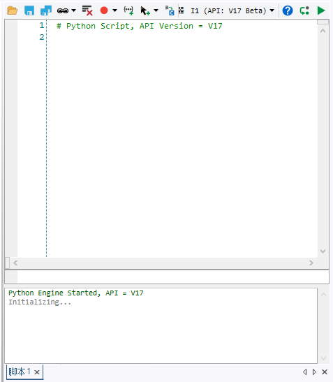

[首页](https://wshwwl.github.io)  [关于](https://wshwwl.github.io/about.html) 

# 通过Python脚本操作Space_Claim

[TOC]

## 批处理问题

一个比下图还要复杂的结构，它的特征就是板上面有很多孔，为了简化有限元分析，需要把这些孔都填上。常规操作是，选中孔的全部内表面，然后进行Fill或者Delete即可。但是当时的结构上有非常多的孔，一个一个点选非常麻烦，而且选到一半很有可能出错导致从头开始。



## 选择功能的局限

SpaceClaim里面有批量的选择功能，然而面对这种问题也无能为力。在选中孔内的2个面的情况下，选择`凹陷`，会选择这个孔的四个内表面。如果根据相同面积的方法来选择，也只能选择所有孔内表面中的所有竖直的面，或者水平的面。如果根据面积范围来选，有可能选中其它不需要的面。



## 新建脚本

SpaceClaim本身支持IronPython脚本运行，可以用于这种需要批处理的情况。要新建一个脚本文件，依次点击`文件`-->`新建`-->`脚本`，便可打开SpaceClaim的脚本界面。



## 脚本编辑器

这个界面包含工具栏、脚本文件编辑窗口、命令输入运行窗口和响应结果输出窗口。使用工具栏可以进行打开、保存、录制、运行、插入、调试脚本文件等操作。

点击工具栏中的`?`图标，可以打开SpaceClaim的帮助文档，并跳转到脚本的介绍页面，里面给出了如何使用运行脚本的基本介绍。关于Python脚本，相关API可以参考安装目录里面的`API_Scripting_Class_Library.chm`文件。



## 批量填充的脚本

解决上述问题的脚本如下：

  ```python
# Python Script, API Version = V17
#预先选取一个孔的任意内表面，然后运行此脚本
selectedFaceArea=Selection.GetActive().Items[0].Area  #获取所选面的面积
sameAreaFaces=PowerSelection.Faces.ByArea(selectedFaceArea).Items # 选取所有具有相同面积的面
for face in sameAreaFaces: #遍历所有具有相同面积的面
    if not face.IsDeleted: #如果该面还存在
        Fill.Execute(PowerSelection.Faces.Depressions(Selection.Create(face))) #选取该面所在的凹陷，然后使用Fill命令填充。
  ```

---

## 2019/12/3 补充编辑

偶然一次机会在同事那里显摆时被告知有一种方法可以简单的实现上述操作。就是选中方孔内部两个相邻面，然后在“选择”菜单里面会出现两个“具有相同面积的面”选项，依次点击这两个选项，即可以选择所有方孔的内表面，然后进行填充。


