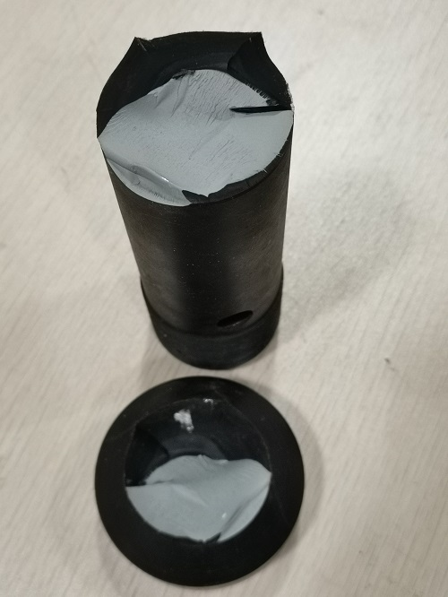

[首页](https://wwl.today)  [关于](https://wwl.today/about.html) 

# 记一次冲击试验

冲击对象为轻木，世界上最轻的木材，广泛用于吸收冲击能量。

这次的试验稍微有点随意，由于锤头不够大，木块的上方垫了一块铝合金板，对木块的压缩和数据的采集都有一定的影响。

<iframe src="//player.bilibili.com/player.html?aid=80078145&cid=137044721&page=1" scrolling="no" border="0" frameborder="no" framespacing="0" allowfullscreen="true"> </iframe>
试验中间设备的锤头砸断了。。。可以看得出来，锤头上的裂纹已经生长了好久了。

