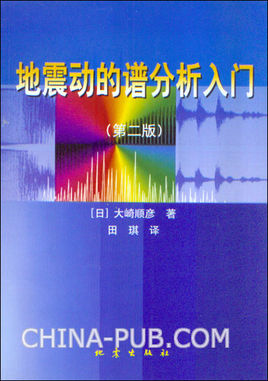

[首页](https://wwl.today)  [关于](https://wwl.today/about.html) 

#　反应谱求解

[toc]

## 反应谱定义

**反应谱**：是在给定的地震加速度作用期间，单质点系统的最大反应随系统自振周期变化的曲线。

更直观的定义：一组具有相同阻尼、不同自振周期的单质点系统，在某一地震时程作用下的最大反应，为该地震的反应谱，分为加速度反应谱、速度反应谱与位移反应谱。

## 参考书籍

接触反应谱主要源于力学分析工作中的谱分析，主要是抗震分析。

有关于反应谱和地震相关的学习主要参考书籍**《地震动的谱分析入门》**，作者为日本的**大崎顺彦**，写的非常好。



这本书里面给出了地震动加速度激励下线性单质点弹簧阻尼系统的响应的求解方法和Fortran代码，用的是线性加速度法，是一种直接积分法。

## 线性加速度法

设质点对地面的相对位移为$x$，固有频率为$\omega$，阻尼为$h$，地震加速度时间历程为$\ddot{y}(t)$，则系统的运动方程可表示为：
$$
\ddot{x}+2h\omega\dot{x}+{\omega}^2x=-\ddot{y}(t)\qquad(a)
$$
设$\ddot{y}(t)$是按一定的时间间隔$\Delta t$，在每个时刻$t_1$,$t_2$,...$t_i$...以离散值$\ddot{y}_1$,$\ddot{y}_2$,...$\ddot{y}_i$...给出的，则当把$\ddot{y}_i$和$\ddot{y}_{i+1}$之间以直线内插，设$t_i$为区间$t_i$~$t_{i+1}$的原点，$\tau$为该区间的局部时间，$\Delta\ddot{y}=\ddot{y}_{i+1}-\ddot{y}_i$时，可把$\ddot{y}(t)$表示为：
$$
\ddot{y}(t)=\frac{\Delta\ddot{y}}{\Delta t}+\ddot{y}_t
$$
在该区间内公式1成为：
$$
\ddot{x}(\tau)+2h\omega\dot{x}(\tau)+\omega^2x(\tau)=-\frac{\Delta\ddot{y}}{\Delta t}\tau+\ddot{y}\qquad 0\le\tau\le\Delta t
$$

解该非齐次方程，当给定区间在开始时刻$t_i$的初始时刻初始条件为
$$
\tau=0,x=x_i,\dot{x}=\dot{x}_i
$$
在区间终点$\tau=\Delta t$，即在时刻$t_{i+1}=t_i+\Delta t$时的相对位移及相对速度为：
$$
x_{i+1}=A_{11}x_i+A_{12}\dot{x}_i+B_{11}\ddot{y}_i+B_{12}\ddot{y}_{i+1}\qquad\quad\\
 
\dot x_{i+1}=A_{21}x_i+A_{22}\dot{x}_i+B_{21}\ddot{y}_i+B_{22}\ddot{y}_{i+1}\qquad(b)
$$
其中：
$$
A_{11}=e^{-h\omega \Delta t}(cos\omega_d\Delta t+\frac{h\omega}{\omega_d}sin\omega_d\Delta t)
$$

$$
A_{12}=e^{-h\omega \Delta t}\frac{1}{\omega_d}sin\omega_d\Delta t
$$

$$
A_{21}=-e^{-h\omega \Delta t}\frac{\omega^2}{\omega_d}sin\omega_d\Delta t
$$

$$
A_{22}=e^{-h\omega \Delta t}(cos\omega_d\Delta t-\frac{h\omega}{\omega_d}sin\omega_d\Delta t)
$$

$$
B_{11}=e^{-h\omega \Delta t}[(\frac{1}{\omega^2}+\frac{2h}{\omega^3\Delta t})cos\omega_d\Delta t+(\frac{h}{\omega\omega_d}-\frac{1-2h^2}{\omega^2\omega_d\Delta t})sin\omega_d\Delta t]-\frac{2h}{\omega^3\Delta t}
$$

$$
B_{12}=e^{-h\omega \Delta t}[-\frac{2h}{\omega^3\Delta t}cos\omega_d\Delta t+\frac{1-2h^2}{\omega^2\omega_d\Delta t}sin\omega_d\Delta t]-\frac 1{\omega^2}+\frac{2h}{\omega^3\Delta t}
$$

$$
B_{21}=e^{-h\omega \Delta t}[-\frac{1}{\omega^2\Delta t}cos\omega_d\Delta t-(\frac{h}{\omega\omega_d\Delta t}+\frac{1}{\omega_d})sin\omega_d\Delta t]+\frac{1}{\omega^2\Delta t}
$$

$$
B_{22}=e^{-h\omega\Delta t}[\frac{1}{\omega^2\Delta t}cos\omega_d\Delta t+\frac{h}{\omega\omega_d\Delta t}sin\omega_d\Delta t]-\frac{1}{\omega^2\Delta t}
$$

求得$x_{i+1}$后，由（a）式可求得绝对加速度反应：
$$
(\ddot x+\ddot y)_{i+1|}=-(2h\omega\dot x_{i+1}+\omega^2x_{i+1})\qquad(c)
$$
当给定t=0时，反应的初值为：
$$
x_1=0\\
\dot{x}_1=-\ddot{y}_1\Delta t\\
(\ddot x+\ddot y)=2h\omega\ddot y_1\Delta t
$$
时，按（b）、（c）式就可逐次计算得到反应值（我在实际计算时全取0）。

另外，在计算（b）式各系数时，定义以下变量以便编制程序：
$$
E=e^{-h\omega\Delta t}\\
SS=-h\omega sin\omega\Delta t-\omega_dcos\omega_d\Delta t\\
CC=-h\omega cos\omega_d\Delta t+\omega_dsin\omega_d\Delta t\\
$$

$$
S1=(E\cdot SS+\omega_d)/\omega^2\\
C1=(E\cdot CC+h\omega)/\omega^2
$$

$$
S2=(E\Delta t\cdot SS+h\omega S1+\omega_d\cdot C1)/\omega^2\\
C2=(E\Delta t\cdot CC+h\omega C1-\omega_d)\cdot S1)/\omega^2
$$

$$
S3=\Delta t\cdot S1-S2\\
C3=\Delta t\cdot C1-C2
$$

## 线性加速度法求解程序

```Matlab
function [acc,vel,dis]=sdof_response(h,f,dt,ddy)
%sdof_response 求解单质点阻尼系统在地震加速度激励下的响应；
% h:阻尼比
% f：系统固有频率（Hz）
% dt：地震加速度时程采样时间间隔
% ddy：地震加速度时程

n_sample=length(ddy);
acc=zeros(1,n_sample);
vel=zeros(1,n_sample);
dis=zeros(1,n_sample);

w=2*pi*f;
w2=w*w;
hw=h*w;
wd=w*sqrt(1-h*h);
wdt=wd*dt;
E=exp(-hw*dt);
cwdt=cos(wdt);
swdt=sin(wdt);
a11=E*(cwdt+hw*swdt/wd);
a12=E*swdt/wd;
a21=-E*w2*swdt/wd;
a22=E*(cwdt-hw*swdt/wd);

ss=-hw*swdt-wd*cwdt;
cc=-hw*cwdt+wd*swdt;
s1=(E*ss+wd)/w2;
c1=(E*cc+hw)/w2;
s2=(E*dt*ss+hw*s1+wd*c1)/w2;
c2=(E*dt*cc+hw*c1-wd*s1)/w2;
s3=dt*s1-s2;
c3=dt*c1-c2;
b11=-s2/wdt;
b12=-s3/wdt;
b21=(hw*s2-wd*c2)/wdt;
b22=(hw*s3-wd*c3)/wdt;

acc(1)=0;
vel(1)=0;
dis(1)=0;

for i=2:n_sample
    dis(i)=a11*dis(i-1)+a12*vel(i-1)+b11*ddy(i-1)+b12*ddy(i);
    vel(i)=a21*dis(i-1)+a22*vel(i-1)+b21*ddy(i-1)+b22*ddy(i);
    acc(i)=-2*hw*vel(i)-w2*dis(i);
end
```

## 响应谱的求解

通过上述方法可以求得任意单个固有频率的系统在地震激励下的响应（含位移、速度、加速度），根据反应谱定义，输入一系列不同的待求解频率，分别取其反应的最大值，即可求得反应谱。

以加速度反应谱为例，可以通过以下代码求出：

```matlab
function  rsacc = tts(h,freqs,acc,dt)
%TTS 求解给定的地震加速度时程的加速度反应谱
%h 系统阻尼比
%freqs 待求解的频率点
%acc 地震加速度时程
%dt 地震时程的采样时间间隔
n=length(freqs);
rsacc=zeros(1,n);
 for i=1:n
     rsacc(i)=max(abs(sdof_response(h,freqs(i),dt,acc)));
 end 
end
```

## 示例

以下以一段随机数作为地震波，采样频率100Hz，然后求其响应谱。

```matlab
fs=100; %采样频率
T=60;   %时长
ddy=rand(fs*T,1)-0.5; %时程
h=0.02; %阻尼比
dt=1/fs;
freqs=logspace(log10(0.1),log10(100),100);
accResponseSpectrum=tts(h,freqs,ddy,dt);
subplot(2,1,2);
plot(freqs,accResponseSpectrum);
xlabel('频率(Hz)');
ylabel('加速度反应谱值');
grid on
subplot(2,1,1);
plot(0:dt:T-dt,ddy);
xlabel('时间(s)');
ylabel('加速度');
grid on;
```


