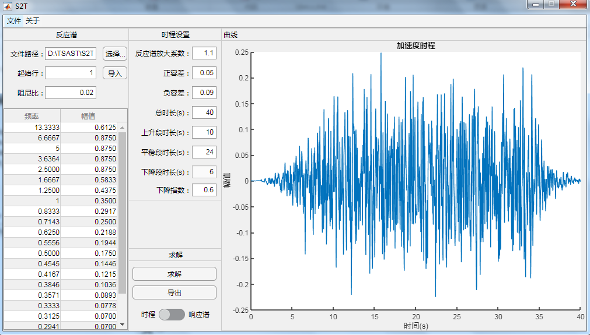
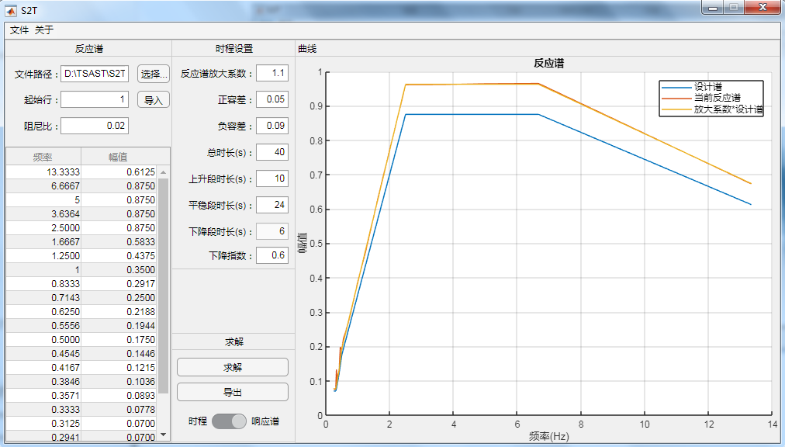

[首页](https://wshwwl.github.io)  [关于](https://wshwwl.github.io/about.html) 

# 反应谱合成时程程序（Matlab APP）

根据[三角级数法合成地震动](..\25\S2T.html)中的方法，编写了一个Matlab下的GUI程序，如下图：

求解过程中，为使得生成的加速度时程曲线偏于保守，会在设计反应谱上乘以一个系数，一般在原有基础上增大10%，即放大系数取1.1。生成的加速度时程的反应谱则以放大放大后的设计谱为目标进行迭代，下图中生成的加速度反应谱与放大后的设计反应谱几乎重合。

