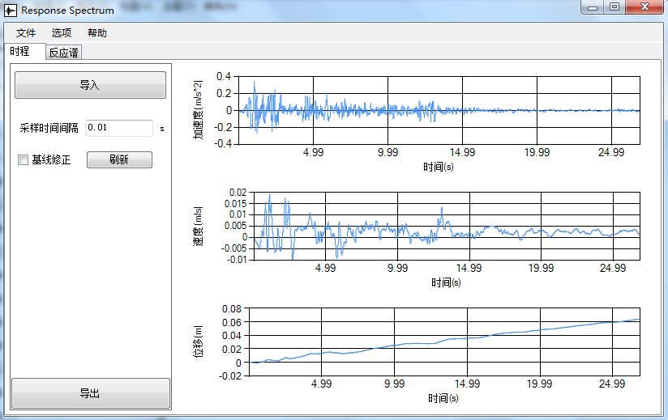
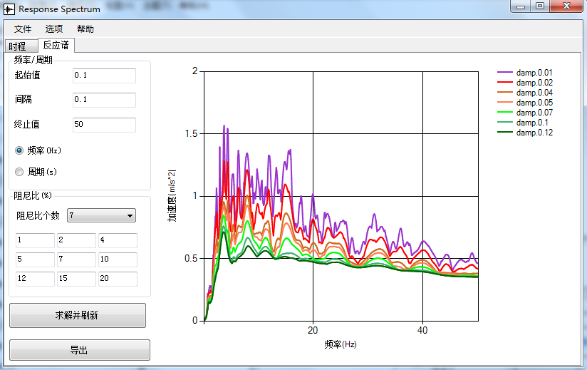

[首页](https://wwl.today)  [关于](https://wwl.today/about.html) 

# 时程转反应谱软件

参考：

> [反应谱求解](..\02\Response.html)
>
> [反应谱求解的修正](..\04\Response2.html)

中所述的方法，编写了一个求解反应谱的GUI工具，实现的功能包括

1. 基线修正；
2. 加速度积分；
3. 按频率或周期求解反应谱。

如下图所示：

