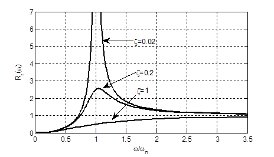
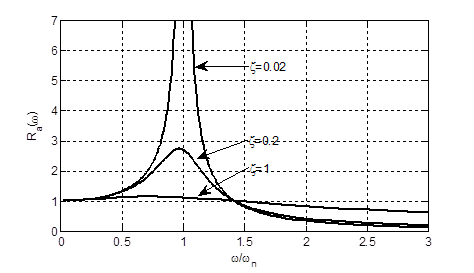

[首页](https://wwl.today)  [关于](https://wwl.today/about.html) 

# 隔振设计（一）  隔振系统的幅频特性

运输某设备，为承载面传递给设备的振动载荷，采取的做法为在设备与承载基础之间设置弹簧或橡胶等结构。

将设备视为刚体，其具三个平动自由度，三个转动自由度，若考虑六个自由度之间相互独立，不产生耦合，则隔振系统的各自由度运动微分方程统一为：
$$
m(\ddot x+\ddot u)+c\dot x+kx=0
$$
变换后得：
$$
\ddot x+2\zeta\omega_n\dot x+\omega_n^2x=-\ddot u
$$
其中$u$为汽车、火车、船等运输设备的承载基础位移，$x$为浮动设备相对基础的位移，$\zeta=c/(2m\omega_n)$，$\omega_n=\sqrt{k/m}$。

两边做傅氏变换，得到系统的传递函数：
$$
H_r(\omega_)=\frac{X(\omega)}{U(\omega)}=\frac{\omega^2}{-\omega^2+2i\zeta\omega\omega_n+\omega_n^2}
$$
则设备的相对位移传递率为其绝对值，取$\lambda=\omega/\omega_n$，有：
$$
R_r(\omega)=\left|\frac{\omega^2}{-\omega^2+2i\zeta\omega\omega_n+\omega_n^2}\right|=\frac{\lambda^2}{\sqrt{(1-\lambda^2)^2+4\zeta^2\lambda^2}}
$$
设备的绝对位移表示为相对位移与承载基础位移之和，其传递函数为：
$$
H_a(\omega)=\frac{X(\omega)_+U(\omega)}{U(\omega)}=\frac{2i\zeta\omega\omega_n+\omega_n^2}{-\omega^2+2i\zeta\omega\omega_n+\omega_n^2}
$$
因此设备的绝对位移传递率为：
$$
R_a(\omega)_=\left|\frac{2i\zeta\omega\omega_n+\omega_n^2}{-\omega^2+2i\zeta\omega\omega_n+\omega_n^2}\right|=\sqrt{\frac{1+4\zeta^2\lambda^2}{(1-\lambda^2)^2+4\zeta^2\lambda^2}}
$$
分别绘制 $R_r(\omega)$与$R_a(\omega)$ 如图1与图2所示。相对位移也表示摄这相对于基础的位移，相对位移越大，减震器的变形也越大。图1与图2中，当基础振动频率远低于系统固有频率时，相对位移为0，绝对位移等于基础的位移，即浮动结构相对于容器静止；当系统固有频率远低于基础振动频率时，相对位移等于基础的位移，绝对位移为0；当$\omega/\omega_n>\sqrt{2}$时，$R_a<1$，系统起减振效果。



<center><b>图1 相对位移幅频特性</b> </center>


<center><b>图 2  绝对位移的幅频特性</b></center>
```matlab
dr=[0.02;0.2;1]; %\zeta
r=0.01:0.01:5;  %w/wn
nr=1./r;
Ha=(2i*dr*r+1)./(-r.^2+2i*dr*r+1);
Hr=1./(-1+2i*dr*nr+nr.^2);

plot(r,abs(Hr),'black','linewidth',2);
grid on
xlabel('\omega/\omega_n');
ylabel('R_r(\omega)');
```

