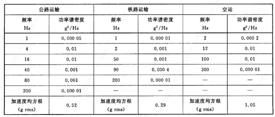
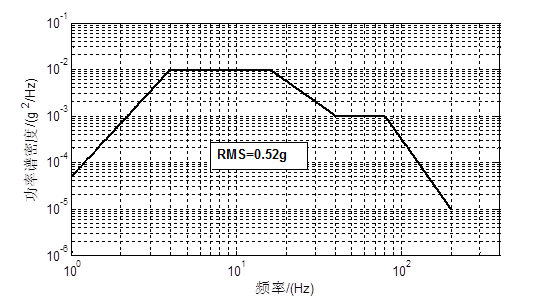
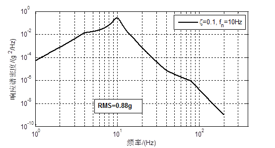
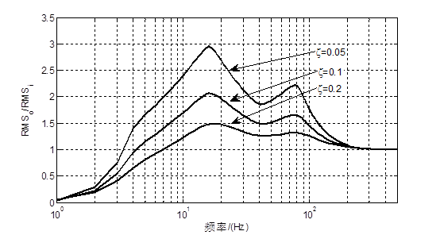

[首页](https://wwl.today)  [关于](https://wwl.today/about.html) 

# 隔振设计（二）  隔振系统的随机振动分析

[toc]

## （一）随机振动理论

根据随机振动理论，对于单一输入的$PSD$值$S_i(\omega)$，系统的输出$S_o(\omega)$为：
$$
S_o(\omega)=|H(\omega)|^2S_i(\omega)=R(\omega)^2S_i(\omega)
$$
则系统响应的均方根值为：
$$
RMS=\sqrt{\int_0^\infty S_o(\omega)d\omega}
$$
假设运输工具承载基础的随机振动服从高斯正太分布，对于均值为0的随机振动，其均方根值$RMS$即为其标准差$\sigma$，对应概率为$68.27\%$。高偏差的振动发生的概率很低，因此，实际计算中一般取$3\sigma$为计算的上限，其对应概率为$99.737\%$。

## （二） ASTM中典型运输方式的加速度功率谱密度

下表列举了ASTM D4728-06中不同运输方式的几种不同振动强度的加速度功率谱密度曲线。



不考虑空运时，公路运输的功率谱密度曲线包络铁路运输，其功率谱密度曲线如图1​所示，该功率谱的加速度均方根值为$0.52g$。



<center><b>图1 公路运输谱密度曲线</b> </center>
## （三）响应的功率谱密度

以固有频率为$10Hz$，阻尼比$\zeta=0.1$的隔振系统为例，在该功率谱密度曲线作为输入的情况下，系统的绝对加速度响应谱密度曲线为图2所示，其均方根值$RSM=0.88g$，$3RMS=2.64g$。



<center><b>图2 系统加速度响应谱密度曲线</b></center>
为寻找系统合适的固有频率范围，将该公路运输谱密度曲线作为输入，施加在不同固有频率、阻尼的隔振系统上，求其绝对加速度响应的均方根值，得到结果如图3所示。图3中，纵坐标表示绝对加速度响应的均方根值与输入谱密度的均方根之比。

图3中，对于阻尼比$\zeta=0.1$的系统，只有当固有频率小于$4.1Hz$时，其输出输入响应之比才会小于1，起减振效果。当固有频率很大时，输入输出之比逐渐接近1。系统的阻尼比越大，响应越小，减振效果越明显。若阻尼比 $\zeta=0.2$，则固有频率小于$6.8Hz$时，其输出输入响应之比小于$1$，起减震作用。此外，设备在运输过程中，为保证组件安全，给出其所能承受的加速度限值$G$，则可以根据路谱的均方根值与输出输入之比选择具有合适的固有频率和阻尼比的系统。



<center><b>图3 绝对加速度响应—系统固有频率</b> </center>
---

> **附-图2代码：**

```matlab
%fw,sw为输入功率谱密度曲线
fw=[1.,4.,16.,40.,80.,200.];
sw=[5.e-005,1.e-002,1.e-002,1.e-003,1.e-003,1.e-005];
%阻尼比
dampRatio=0.1; 
%固有频率
fn=10;
%对输入的功率谱曲线插值
logfw=log10(fw);
logsw=log10(sw);
minlogfw=min(logfw);
maxlogfw=max(logfw);
ilogfw=minlogfw:(maxlogfw-minlogfw)/1000:maxlogfw;
ilogsw=interp1(logfw,logsw,ilogfw);
ifw=10.^ilogfw;
isw=10.^ilogsw;
%rsw:响应的功率谱密度曲线
rsw=RPS(ifw,isw,fn,dampRatio);
loglog(ifw,rsw)
grid on;
xlabel('频率/(Hz)');
ylabel('响应谱密度/(g^2/Hz)');
legend(['\zeta=',num2str(dampRatio),',f_n=',num2str(fn),'Hz']);

%求解固有频率fn，阻尼比dampRatio的系统的响应谱密度曲线的函数
function rps = RPS(fw,sw, fn ,dampRatio)
    r=fw/fn;
    Ra=sqrt((1+4*dampRatio^2*r.^2)./((1-r.^2).^2+4*dampRatio^2*r.^2));
    rps=Ra.^2.*sw;
end
```

---

> **附-图3代码：**

```matlab
%fw,sw为输入功率谱密度曲线
fw=[1.,4.,16.,40.,80.,200.];
sw=[5.e-005,1.e-002,1.e-002,1.e-003,1.e-003,1.e-005];
%对输入的功率谱曲线插值
logfw=log10(fw);
logsw=log10(sw);
minlogfw=min(logfw);
maxlogfw=max(logfw);
ilogfw=minlogfw:(maxlogfw-minlogfw)/1000:maxlogfw;
ilogsw=interp1(logfw,logsw,ilogfw);
ifw=10.^ilogfw;
isw=10.^ilogsw;
%阻尼比
dampRatio=[0.05,0.1,0.2]; 
%固有频率
% fn=1:500;
fn=logspace(log10(1),log10(500),200);
%rsm存储各个固有频率、阻尼比的系统的响应均方根值与输入的比值
rsm=zeros(length(fn),length(dampRatio));
%rsw:响应的功率谱密度曲线
for i=1:length(dampRatio)
    for j=1:length(fn)
        rsw=RPS(ifw,isw,fn(j),dampRatio(i));
        rsm(j,i)=sqrt(trapz(ifw,rsw));
    end
end
rsmInput=sqrt(trapz(ifw,isw));
rsm=rsm/rsmInput;
for i=1:length(dampRatio)
    semilogx(fn,rsm(:,i));
    hold on;
end
hold off;
grid on;
xlabel('频率/(Hz)');
ylabel('RMS_o/RMS_i');
legend('\zeta='+string(dampRatio));

%求解固有频率fn，阻尼比dampRatio的系统的响应谱密度曲线的函数
function rps = RPS(fw,sw, fn ,dampRatio)
r=fw/fn;
Ra=sqrt((1+4*dampRatio^2*r.^2)./((1-r.^2).^2+4*dampRatio^2*r.^2));
rps=Ra.^2.*sw;
end
```

