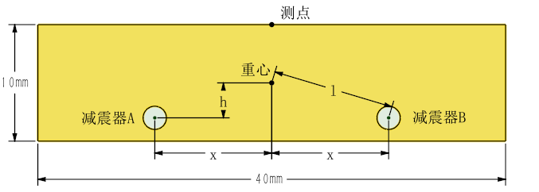
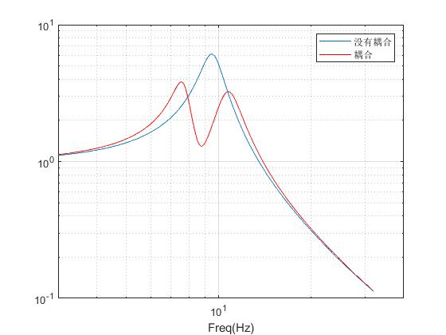

[首页](https://wwl.today)  [关于](https://wwl.today/about.html) 

# 隔振设计（四）  隔振系统的耦合分析

[toc]

## （一）简介

该部分内容主要用于解释试验现象并修正试验结果。

前面讨论的都是设备的六个自由度之间相互独立，而实际的情况是设备的重心要高于减震器所在的平面。一个简化的示意图如下图所示，减震器A、B径向刚度为$k$，阻尼系数$c$，与设备重心的水平距离为$x$，垂直距离为$h$，直线距离为$l$。

当发生上下的振动激励时，设备产生上下振动，不会发生旋转。而当发生左右的振动激励时，设备除了产生左右振动以外，还会产生绕垂直平面的转动。此时测量测点的水平响应，若根据原有公式计算减震器的参数则会产生错误。

## （二）考虑耦合的运动方程

当发生沿水平方向的振动激励时，考虑耦合后的运动方程为：
$$
\begin{cases}
m(\ddot x+\ddot u)+c(\dot x+h\dot\varphi)+k(x+h\varphi)=0\\
I\ddot\varphi+c\left( l^2\dot\varphi+h\dot x\right)+k\left( l^2\dot\varphi+hx\right)=0
\end{cases}
$$

其中，$\varphi$为设备的转角，$I$为设备的转动惯量，取$s=l^2$。对上式作傅氏变换后整理得：
$$
\begin{cases}
(-m\omega^2+jc\omega+k)X(\omega)+(jch\omega+kh)\varPhi(\omega)=m\omega^2U(\omega)\\
(-I\omega^2+jsc\omega+sk)\varPhi(\omega)+(jch\omega+kh)X(\omega)=0
\end{cases}
$$
取$A=-m\omega^2+jc\omega+k$，$B=jch\omega+kh$，$C=-I\omega^2+jsc\omega+sk$，可求得传递函数：
$$
\begin{cases}
\frac{X(\omega)}{U(\omega)}=\frac{m\omega^2}{A(1-\frac{BB}{AC})}=\frac{H_{rx}(\omega)}{1-\frac{BB}{AC}}\\
\frac{\varPhi(\omega)}{X(\omega)}=-\frac{B}{C}
\end{cases}
$$
其中$H_rx(\omega)$为相互独立时平动自由度的相对位移传递函数。$B/A$，$B/C$的值分别为：
$$
\begin{cases}
B/A=H_{ax}\cdot x\\
B/C=H_{a\varphi}\cdot h/s=H_{a\varphi}\cdot \frac{h}{l^2}
\end{cases}
$$
上式中，$B/C$描述了耦合程度的大小，$H_{a\varphi}$为相互独立时转动自由度的绝对位移传递函数。

由上式可知，设备的重心偏差$h$越小，$l$越大（减震器分布距离重心越远），则耦合程度越低。同时，当水平激励的频率接近转动自由度的频率时，$H_{a\varphi}$也会增大，即导致转动自由度的响应变大，也就是耦合程度增大。

## （三）耦合对试验测试的影响

实际设备中减震器分布较广，因此耦合程度可能较低。为了做实验测试减震器的性能，会对设备进行缩放。当缩放过程中$h$没变，而$l$却缩小了，则耦合现象会更加明显，试验测得的固有频率发生变化。此时若仍按平动的运动方程反推减震器参数，则会发生偏差。

