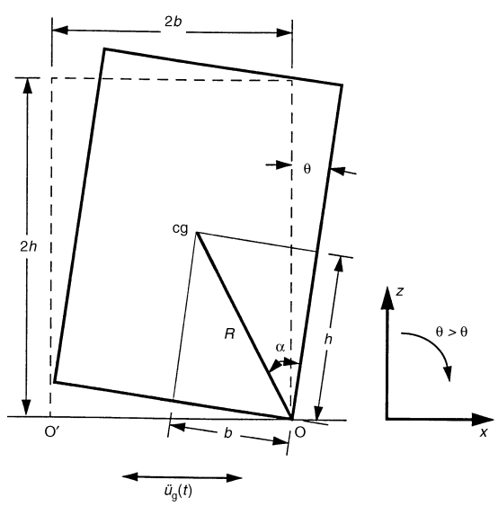

[首页](https://wshwwl.github.io)  [关于](https://wshwwl.github.io/about.html) 

# 自由放置的刚体在地震下的摆动响应

[toc]

## 1. 运动方程

自由放置于地面的刚体如下图所示，在地面加速度$\ddot u_g(t)$的激励下，刚体会绕点$o$和点$o'$发生摆动。



该刚体的运动方程为：
$$
I_O\ddot\theta+mgRsin(-\alpha-\theta)=-m\ddot u_gRcos(-\alpha-\theta),\theta<0\\
I_O\ddot\theta+mgRsin(\alpha-\theta)=-m\ddot u_gRcos(\alpha-\theta),\theta>0 \quad
$$
其中，$I_O=(4/3)mR^2$，将上式两侧同时除以$I_O$，得：
$$
\ddot\theta(t)=-p^2\{sin(\alpha sgn[\theta(t)]-\theta(t))+\frac{\ddot u_g}{g}cos(\alpha sgn[\theta(t)]-\theta(t))\}
$$
其中，$p=\sqrt{(3g/4R)}$，单位为$rad/s$，$sgn$为符号函数。

## 2. 摆动周期

不考虑地震的激励作用，也不考虑刚体来回摆动过程中的能量损耗，则刚体从倾斜$\theta_0$的初始状态，摆回到竖直状态所花费的时间为其摆动周期的1/4。刚体从倾斜$\theta_0$的的状态摆回到竖直状态过程中的运动方程为：
$$
I_O\frac{d^2\theta}{dt^2}=-mgRsin(\alpha-\theta)
$$
对于细长的刚体（$\alpha<20^\circ$），上述方程可以简化为线性形式：
$$
I_O\ddot\theta-mgR\theta=-mgR\alpha
$$
两侧同时除以$I_O$,得到：
$$
\ddot\theta-p^2\theta=-p^2\alpha
$$
带入初始条件$\theta=\theta_0,\dot\theta=0$，该方程的解为：
$$
\theta=\alpha-(\alpha-\theta_0)cosh(pt)
$$
当$t=T/4$时，刚体处于竖直状态，即$\theta=0$，带入上式：
$$
0=\alpha-(\alpha-\theta_0)cosh(p\frac{T}{4})
$$
即
$$
cosh\frac{pT}{4}=\frac{1}{1-\theta_0/\alpha}
$$
则其周期为：
$$
T=\frac{4}{p}cosh^{-1}(\frac{1}{1-\theta_0/\alpha})
$$
上述方程绘制出来如下图所示。

```matlab
theta_alpha=0:0.02:0.98;
Tp_4=acosh(1./(1-theta_alpha));
plot(theta_alpha,Tp_4);
grid on;xlabel('\theta_0/\alpha');ylabel('Tp/4');
```


上图说明了刚体摆动的周期不是定值，当刚体的初始倾斜角度越大时，其摆动的周期也越大，但其摆动周期和初始倾斜角度之间并不是线性关系。当刚体的初始倾斜角度无限接近$\alpha$时，其摆动周期接近无限大。物理意义上来说，这种状态下，刚体的重心在地面的投影落在支撑点上，处于平衡状态，不发生转动。一旦有所扰动，要么往回摆动，要么倾翻。

## 3. 能量耗散

刚体在摇摆的方向发生变化时，会与地面发生一次冲击，根据角动量守恒，可以得到：
$$
I_O\dot\theta_1-2mRb\dot\theta sin\alpha=I_O\dot\theta_2
$$
刚体的动能可以用刚体的角速度的平方$\dot\theta^2$来描述，由于与地面碰撞产生能量损失，假设碰撞后刚体的动能为碰撞前的动能乘以一个系数r，即：
$$
\dot\theta_{n+1}^2=r\cdot\dot\theta_n^2
$$
结合以上两式，可得：
$$
r=[1-\frac{3}{2}sin^2(\alpha)]^2
$$


## 4. 在余弦激励下的响应

假设地面加速度为一个周期的余弦脉冲，使用ODE45求解第一节中的运动方程，取刚体参数$p=2,\alpha=15^\circ$。则不同脉冲幅值下，刚体的转角和角速度分别如下图。

 

可见在脉冲的幅值低于0.315g前，刚体是不会倾翻的，其转角幅值逐渐衰减。而当脉冲的幅值达到0.316g时，计算在3s前终止了，原因为刚体的转角过大，超过了$\alpha$，即刚体的重心在地面的投影已经落到了支点的外侧，发生了倾翻。

为了观察第二节描述的刚体摆动周期随其转角无限增大的情况，这里可以逐步增大脉冲幅值至临界值，如下图所示。随着脉冲幅值的微幅增大，刚体的角速度接近于0的时间越长，在这段时间里，刚体近乎于静止状态。

```matlab
function nonlinearrock(alpha,p)
    p=2;alpha=deg2rad(15);
    ap=0.315034034;
    omega=pi;    tstop=2;
    tg=0:0.1:10; tcos=0:0.1:tstop;
    ag=zeros(1,length(tg));
    ag(1:length(tcos))=ap*cos(omega*tcos);
    subplot(3,3,3)
    plot(tg,ag); xlabel('time(s)');ylabel('脉冲幅值(g)');title(['A=',num2str(ap,9),'g']);grid on;

    %%%
    tspan=[0,10];
    inity=[0,0];
    option=odeset('RelTol',1e-8,'AbsTol',1e-10,'Events',@EventFcn);
    while tspan(1)<tspan(end)
        [rt_temp,ry_temp,te,ye,ie]=ode45(@wffc,tspan,inity,option);
        subplot(3,3,6);plot(rt_temp,ry_temp(:,1)/alpha,'black');hold on;
        subplot(3,3,9);plot(rt_temp,ry_temp(:,2),'r'); hold on;
        if isempty(ie)
            break;
        end
        if ie(end)==1
            inity=ye(end,:);
            inity(2)=inity(2)*(1-1.5*(sin(alpha))^2);
            tspan=[te(end),tspan(end)];
            if abs(inity(2))<1e-6
                break;
            end
            continue;
        end
        if ie(end)==2
            break;
        end
    end
    subplot(3,3,6);xlabel('time(s)');ylabel('\theta/\alpha');hold off;grid on;
    subplot(3,3,9);xlabel('time(s)');ylabel('\theta''');hold off;grid on;
    
    function dy=wffc(t,y)
        dy=zeros(2,1);
        sgn=sign(y(1));
        if sgn==0
            sgn=sign(y(2));
        end
        dy(1)=y(2);
        if t<=tstop
            dy(2)=-p^2*(sin(alpha*sgn-y(1))+ap*cos(omega*t)*cos(alpha*sgn-y(1)));
        else
            dy(2)=-p^2*sin(alpha*sgn-y(1));
        end
    end

    function [value,isterminal,direction]=EventFcn(~,y)
        value(1)=y(1);
        isterminal(1)=1;
        direction(1)=0;
        
        value(2)=abs(y(1))-alpha;
        isterminal(2)=1;
        direction(2)=1;
    end
end
```

## 4. 在地震激励下的响应

```matlab
function [rt,ry]=rock1(alpha,T,tg,ag)
% 求解参数为alpha、T的刚体在时间和幅值依次为tg、ag的地震作用下的响应。
% tg\ag:地震波的时间列和幅值列,ag的单位为g。
p=2*pi/T;
rt=tg;                      % 存储时间点
ry=zeros(length(tg),2);     % 用于存储每个时刻的响应结果，含有两列，第一列为角度，第二列为角速度
% 静止状态下，只有当地震加速度的幅值的绝对值abs(ag)>tan(alpha)时，刚体才开始摆动
% 寻找地震波中第一个幅值的绝对值超过tan(alpha)的点的下标index。
index=find(abs(ag)>tan(alpha),1); 
if isempty(index)
    return;
end
sgn=sign(ag(index));    %该值是正还是负
if index==1             %如果第一个值就足够大，则开始计算的时刻则为地震波的第一个时刻 
    tgtrig=tg(1);
    index=2;
else                    %否则，通过插值求得地震幅值等于tan(alpha)的时刻tgtrig.
    tgtrig=interp1([ag(index-1),ag(index)],[tg(index-1),tg(index)],sgn*tan(alpha));
end
    
%% 求解
%option:ode45的求解参数设置，RelTol为相对误差，AbsTol为绝对误差。
%Events参数指向一个函数，当函数的值为0时，则触发事件。该函数有两个作用：
% 1.当刚体摇摆方向切换时，中断求解，并将摇摆的角速度乘以一个比例系数。
% 2.当刚体的摇摆角度超过alpha时，认为刚体侵翻，终止计算。
option=odeset('MaxStep',0.025,'RelTol',1e-8,'AbsTol',1e-10,'Events',@EventFcn);
inity=[0,0];                % 计算的初始值
tstart=tgtrig;              % 开始求解的时刻，该时刻起，刚体才开始摆动
while tstart<tg(end)        % 每一步循环求解，每次只求解一个时间段，直到地震波的最后一刻
    %调用ode45进行求解，求解的时间段为[tstart,tg(index)]，该时间段求解完后，index加1，然后循环求解
    % @wffc为待求解的微分方程，该方程有3种可能的终止结果
    % 1：正常结束，完成时间段[tstart,tg(index)]段的求解
    % 2: 由于摇摆方向改变导致终止
    % 3：由于摇摆角度超过alpha导致终止。
    % rt_temp，ry_temp为求解后的时间、幅值
    % te为触发事件时的时间，ye为触发事件时的响应，
    % ie的值指示终止的原因，如果ie=1，则是上方可能2，如果ie=2，则是上方可能3
    [rt_temp,ry_temp,te,ye,ie]=ode45(@wffc,[tstart,tg(index)],inity,option);
    subplot(3,1,2);plot(rt_temp,ry_temp(:,1)/alpha,'r');hold on; %
    subplot(3,1,3);plot(rt_temp,ry_temp(:,2),'r');hold on;
    if rt_temp(end)==tg(index)      % ode45正常终止
        ry(index,:)=ry_temp(end,:); % 保存tg(index)时刻的响应
        inity=ry_temp(end,:);       % 该时间段最后时刻的结果作为下一时间段求解的初始值
        tstart=tg(index);           % 下一时间段的起始时刻为tg(index)
        index=index+1;              % 循环开始下一时间段的求解
        continue;
    end
    if ie(end)==1                   % 如果由于摇摆方向改变导致终止
        inity=ye(end,:);            % 下一次求解的初始值为中断求解时的响应
        inity(2)=inity(2)*(1-1.5*(sin(alpha))^2); % 角速度乘以比例系数
        tstart=te(end);             % 下一次求解的初始时间
        if abs(inity(2))<1e-6       % 如果此时角速度小于1e-6,则认为刚体已静止
            inity=[0,0];            % 将下一次的求解初始值设置为0
            nextIndex=find(abs(ag(index:end))>tan(alpha),1); %寻找地震波中下一个幅值超过tan(alpha)的点
            if ~isempty(nextIndex)
                index=index+nextIndex-1;
                sgn=sign(ag(index));
                tstart=interp1([ag(index-1),ag(index)],[tg(index-1),tg(index)],sgn*tan(alpha));  
            else                    % 如果找不到，则刚体不会再摆动，计算终止                
                ry(index,:)=ry_temp(end,:);
                break;
            end
        end
        continue;
    end
    if ie==2    % 如果由于摇摆角度超过alpha，则终止计算
        break;
    end
end

%% 微分方程
    function dy=wffc(t,y)
        dy=zeros(2,1); %用于存储计算结果：角度，角速度
        ag_t=interp1(tg,ag,t,'linear'); %根据线性插值，获取对应时间的地震加速度值
        %微分方程组
        %当刚体处于静止状态时，如果地震加速度小于tan(alpha)则不产生摆动
        if (abs(y(1))==0)&&(abs(y(2))==0)&&(abs(ag_t)<tan(alpha))
            dy(1)=0;
            dy(2)=0;
        else   %刚体摆动的微分方程
            sgn=sign(y(1));
            dy(1)=y(2);
            dy(2)=-p^2*(sin(alpha*sgn-y(1))+ag_t*cos(alpha*sgn-y(1)));
        end
    end
    
    % ode45的事件函数，当value=0时触发。
    function [value,isterminal,direction]=EventFcn(~,y)
        value(1)=y(1);      % 事件1：刚体摇摆方向改变，即此时刚体摇摆角度为0
        isterminal(1)=1;    % isterminal为1时，表示该事件的触发会导致求解终止
        direction(1)=0;     % direction为0，表示value上升到0，或者下降到0，都会触发事件
        
        value(2)=abs(y(1))-alpha;   %事件2：刚体摇摆角度超过alpha时，认为刚体倾翻
        isterminal(2)=1;
        direction(2)=1;             % direction为1，表示value上升到0时，才会触发事件
    end
end
```

