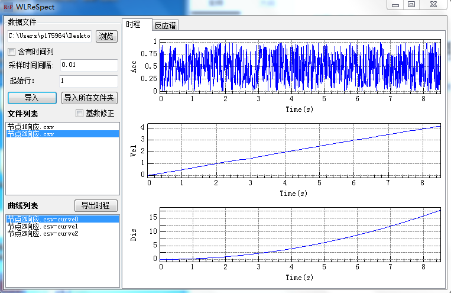
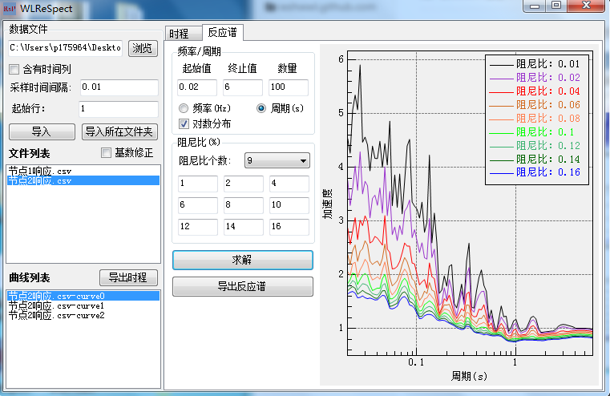

[首页](https://wwl.today)  [关于](https://wwl.today/about.html) 

# 反应谱计算程序1.0.0.0

前一段时间刚写出来了曲线绘图控件，趁热更新了反应谱计算程序，果然很省内存。

更新内容：

* 更新的算法，计算速度更快；
* 可导入多个文件；
* 每个文件可包含多条曲线；
* 可识别文本中的小数或者科学计数法表示的数字；
* 可同时导入文件夹内所有相同扩展名的文件；
* 反应谱求解支持输入频率或者周期，可选择对数分布；

