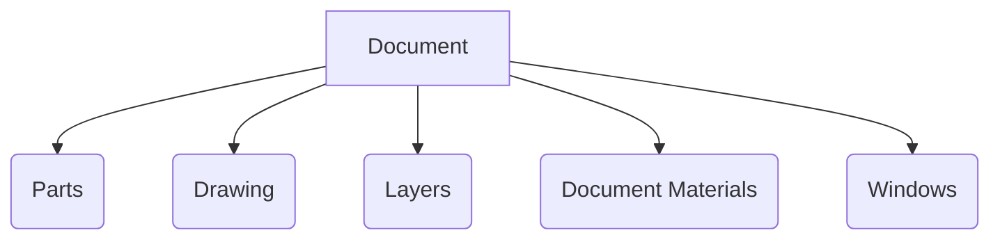
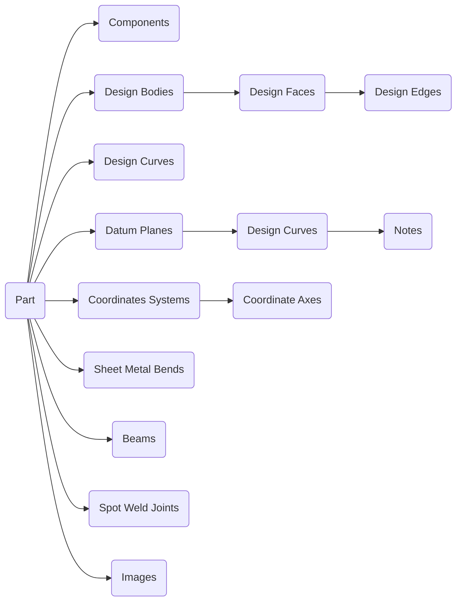

[首页](https://wshwwl.github.io)  [关于](https://wshwwl.github.io/about.html) 

# C#开发SpaceClaim插件

[TOC]

SpaceClaim中常用的操作就那么几个，软件提供了各种方便的快捷键，可以极大的提高操作效率，而唯独使用频率极高的**`隐藏`**命令没有快捷键，非常恼火。瞎点的时候，发现它还提供插件支持。除了官网提供的几个官方插件以外，还可以自己开发插件。

##  SpaceClaim API

ANSYS安装完成后，在安装目录下可以找到插件开发所需的API文档，默认路径是`C:\Program Files\ANSYS Inc\v182\scdm`，在该目录下，可以看到历代版本的API文档文件夹。


每个版本的文件夹内容大致相同，主要文件包括：

* `Developers Guide.pdf`：SpaceClaim API 及相关基本概念的介绍，尤其是SCDM文件结构与文档对象的介绍，开发插件之前需主要阅读该文档；
* `SpaceClaim_API.chm`：介绍如何开发一个插件，同时提供类库的说明文档；
* `SpaceClaim.Api.V17.dll`：用于开发的程序集；
* `Building Sample Add-Ins.pdf`：使用VS调试与生成插件的指南。

## SCDM文件结构与文档对象

一个SCDM文件包含如下对象：



其中，最常接触到的是Parts对象。一个文件通常包含至少一个Part，这个Part为 _main part_，part下面通常包含组件、体、线等文档对象。Part的结构如下所示：



其中，component下面又可以包含components和组件、体、线等文档对象，因此是一个树形结构。

这里Part和Component对象貌似有点冲突，文档中说，`A component is an instance of a template part `，我理解为每一个Part都是独立的，而Component就是它的容器，代替Part组成文档树的结点，每一个Component的content就是一个part。它自带一个转换矩阵，它的作用就像一个中间件和粘合剂，将所有的的Part拼接起来，显示出一个完整的场景视图。当存在多级结构时，自然也就存在多级的转换，如下图所示：


## 一个用于隐藏所选对象的插件

生成的插件被SpaceClaim识别后，会在Ribbon菜单里面多生成一个tab，然后在里面再生成一个Group，Group里面新增一个按钮，点击按钮会执行相应的Command，同时可以给该Command绑定想要的快捷键，以实现最初的需求。


`SpaceClaim_API.chm`中的Getting Started章节描述了开发插件所需的基本要素：

* 新建类库项目后，需要引用`SpaceClaim.Api.V17.dll`程序集；
* 用于承担插件入口功能的类需要继承`AddIn`并实现`IExtensibility`;
* 自定义Command需要实现`ICommandExtensibility`接口；
* 自定义Ribbon菜单需要实现`IRibbonExtensibility`接口，在`GetCustomUI`中需要返回一个XML字符串，该字符串用于描述自定义的Ribbon菜单；
* 编写正确的Manifest文件，SpaceClaim首先寻找该文件，然后根据文件内容加载相应的插件。

这些基本要素可以自行编写，也可以用SpaceClaim提供的模板生成，然后直接编写要实现的Command即可。

```csharp
protected override void OnInitialize(Command command)
{
    base.OnInitialize(command);

    // Add a keyboard shortcut for this command.
    // 绑定快捷键Y
    const Keys shortcut = Keys.Y;
    if (Command.GetCommand(shortcut) == null) //如果该快捷键没有被其他命令绑定
        command.Shortcuts = new[] { shortcut };
}

protected override void OnUpdate(Command command)
{
    //当窗口中选择某对象后，激活该按钮
    command.IsEnabled = Window.ActiveWindow.ActiveContext.Selection.Count > 0;
}

protected override void OnExecute(Command command, ExecutionContext context, Rectangle buttonRect)
{
    Window window = Window.ActiveWindow; //获取当前窗口
    if (window == null) return;
    //获取当前窗口中选中的对象
    ICollection<IDocObject> selectItems = window.ActiveContext.Selection;
    foreach (var selecteditem in selectItems) //遍历所选对象
    {
        IDesignBody visibleItem = selecteditem as IDesignBody ?? selecteditem.GetAncestor<IDesignBody>(); //向上寻找，如果选择的对象为点、线、面、体，则找到DesignBody对象
        if (visibleItem != null )  visibleItem.SetVisibility(null,false); //设置其Visibility属性为false
    }
    window.ActiveContext.Selection = null;
    window.ActiveContext.Preselection = null;
}
```


