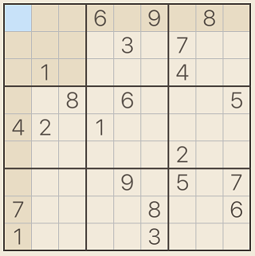

[首页](https://wshwwl.github.io)  [关于](https://wshwwl.github.io/about.html) 

# 数独(Sudoku) 的求解

前几天坐在公交车上无聊，刷朋友圈看到有人晒了两道数独的题目，便好奇拿出笔做了起来，当时的题目很简单，做完之后成就感爆棚，感觉天下无不可解之数独，遂拿起手机下载数独App，开玩笑，直奔**专家级**，小意思。熟料这一题一做就是一个多小时，而且中间有一步还是靠蒙的，才勉强做出了这一题。此时兴致还在，便又来了一题专家级，勉力强撑一个多小时以后放弃了，蒙都不会，最终兴致缺缺。



这类困难的数独不能单靠简单的推导完成，需要层层排除，做到大脑爆栈，回来写了一个数独的求解程序，劈里啪啦的把结果输入App，完成了报复。

```csharp
using System;
using System.Text;
using System.Text.RegularExpressions;

namespace Sudoku
{
    class Sudoku
    {
        private readonly int[,] sudokuMatrix;

        public Sudoku(string input)
        {
            //初始化9x9数字
            sudokuMatrix = new int[9, 9];
            //检查是否输入是81为数字字符串
            if (!String.IsNullOrEmpty(input) && Regex.IsMatch(input,"[0-9]{81}"))
            {
                for (int i = 0; i < 9; i++)
                {
                    for (int j = 0; j < 9; j++)
                    {
                        sudokuMatrix[i, j] = Convert.ToInt32(input[i * 9 + j].ToString());
                    }
                }
            }
            else
            {
                //...异常
            }
        }

        /// <summary>
        /// 求解数独
        /// </summary>
        public void Solve()
        {
            int[,] emptyLocation = new int[64, 2];  //用于存储空单元格的行列，数独最大只有64个空单元格
            int cursor = -1;  //游标，指示当前所在的空单元格

            //遍历数独，寻找空单元格，若找到空单元格，检查该单元格是否有唯一值，如果有则填上唯一值，否则将空格行列记录下来
            for (int i = 0; i < 9; i++)
            {
                for (int j = 0; j < 9; j++)
                {
                    if (sudokuMatrix[i,j]==0) //是否为空单元格
                    {
                        if (FillExclusiveNumble(i,j))  //是否有唯一值，如果有，则填入唯一值，并再次从头开始搜索
                        {
                            i = 0;
                            j = 0;
                            cursor = -1;
                        }
                        else  //如果没有唯一值，则将空格行列号记录下来
                        {
                            cursor += 1;
                            emptyLocation[cursor, 0] = i;
                            emptyLocation[cursor, 1] = j;
                        }
                    }
                }
            }

            //开始逐个空格依次尝试1-9的数字，知道所有空格都填满为止
            while (cursor>=0) //当剩余空格数大于0时
            {
                if (TryNext(emptyLocation[cursor,0],emptyLocation[cursor,1]))  //尝试将当前空格内的数字加1
                {
                    cursor -= 1; //前往下一个空格
                }
                else //如果该空格内无法填入任意数字，则表明前面的空格所填数字有误，返回上一个空格
                {
                    cursor += 1;
                }
            }
        }

        /// <summary>
        /// 尝试在当前空格内填入更大的数字
        /// </summary>
        /// <param name="row">行</param>
        /// <param name="col">列</param>
        /// <returns></returns>
        private bool TryNext(int row,int col)
        {
            for (int i = sudokuMatrix[row,col]+1; i <=9; i++)
            {
                if (Check(row, col, i))
                {
                    sudokuMatrix[row, col] = i; //如果能在当前空格内填入更大的数字，则填入该数字
                    return true;
                }
            }
            sudokuMatrix[row, col] = 0;  //否则将该空格内的数字改为0
            return false;
        }

        /// <summary>
        /// 根据数独规则，判断特定单元格内能否填入某数字
        /// </summary>
        /// <param name="row">行</param>
        /// <param name="col">列</param>
        /// <param name="num">尝试填入的数字</param>
        /// <returns></returns>
        private bool Check(int row,int col,int num)
        {
            for (int index = 0; index < 9; index++)
            {
                if (sudokuMatrix[row, index] == num) return false;
                if (sudokuMatrix[index, col] == num) return false;
                if (sudokuMatrix[row / 3 * 3 + index / 3, col / 3 * 3 + index % 3] == num) return false;
            }
            return true;
        }

        /// <summary>
        /// 数独转换成字符串
        /// </summary>
        /// <returns></returns>
        public override string ToString()
        {
            StringBuilder sb = new StringBuilder();
            for (int i = 0; i < 9; i++)
            {
                for (int j = 0; j < 9; j++)
                {
                    sb.Append(sudokuMatrix[i, j]); 
                }
                sb.Append("\n");
            }
            return sb.ToString();
        }

        /// <summary>
        /// 判断空格是否有唯一值，如有则填入该唯一值
        /// </summary>
        /// <param name="row">行</param>
        /// <param name="col">列</param>
        /// <returns></returns>
        private bool FillExclusiveNumble(int row,int col)
        {
            int count = 0;
            int ExclusivleNumble = 0;
            for (int num = 1; num <= 9; num++)
            {
                if (Check(row,col,num))
                {
                    count += 1;
                    ExclusivleNumble = num;
                }
            }
            if (count == 1)
            {
                sudokuMatrix[row, col] = ExclusivleNumble;
                return true;
            }
            else return false;
        }
    }
}

```


