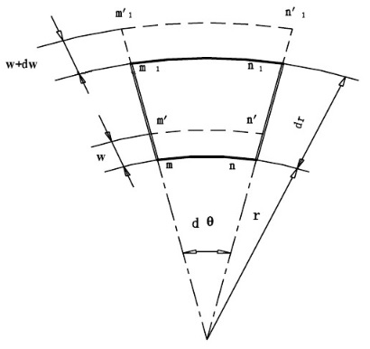

[首页](https://wshwwl.github.io)  [关于](https://wshwwl.github.io/about.html) 

# 厚壁圆管应力评价

[toc]

用于评价承受内外压、轴力、剪力、弯矩、扭矩的圆管解构。

## 内外压作用下应力分布

### 1、轴向应力

假设轴向应力沿壁厚方向均匀分布，得：
$$
\sigma_z=\frac{\pi R^2_ip_i-\pi R^2_op_o}{\pi(R^2_o-R^2_i)}=\frac{p_iR^2_i-p_oR^2_o}{R^2_o-R^2_i}=A
$$

### 2、轴向应力与径向应力

取如下微原体进行分析：

#### a、平衡方程

$$
(\sigma_r+d\sigma_r)(r+dr)d\theta-\sigma_rrd\theta-2\sigma_\theta drsin\frac{\theta}{2}=0\\
=>\quad \sigma_\theta -\sigma_r=r\frac{d\sigma_r}{dr}
$$

#### b、几何方程

$$
\begin{cases}
\varepsilon_r=\frac{(w+dw)-w}{dr}=\frac{dw}{dr}\\
\varepsilon_\theta=\frac{(r+w)d\theta-rd\theta}{rd\theta}=\frac{w}{r}
\end{cases}\\
=>\quad \frac{d\varepsilon_\theta}{dr}=\frac{1}{r}(\varepsilon_r-\varepsilon_\theta)
$$

#### c、物理方程

$$
\begin{cases}
\varepsilon_r=\frac{1}{E}[\sigma_r-\mu(\sigma_\theta +\sigma_z)]\\
\varepsilon_\theta=\frac{1}{E}[\sigma_\theta -\mu(\sigma_r+\sigma_z)]
\end{cases}\\
=>\quad \varepsilon_r-\varepsilon_\theta=\frac{1+\mu}{E}[\sigma_r-\sigma_\theta]
$$

#### d、联立求解

$$
\begin{cases}
\varepsilon_r-\varepsilon_\theta=\frac{1+\mu}{E}[\sigma_r-\sigma_\theta]\\
\frac{d\varepsilon_\theta}{dr}=\frac{1}{r}(\varepsilon_r-\varepsilon_\theta)
\end{cases}=>\frac{d\varepsilon_\theta}{dr}=\frac{1+\mu}{rE}(\sigma_r-\sigma_\theta)
$$

$$
\begin{cases}
\frac{d\sigma_\theta}{dr}-\mu\frac{d\sigma_r}{dr}=\frac{1+\mu}{r}(\sigma_r-\sigma_\theta)\\
\sigma_\theta-\sigma_r=r\frac{d\sigma_r}{dr}
\end{cases}=>r\frac{d^2\sigma_r}{dr^2}+3\frac{d\sigma_r}{dr}=0
$$

解得：
$$
\sigma_r=A-\frac{B}{r^2};\quad \sigma_\theta=A+\frac{B}{r^2}
$$
边界条件：

​				当$r=R_i$时，$\sigma_r=-p_i$；

​				当$r=R_o$时，$\sigma_r=-p_o$。

得到：
$$
A=\frac{p_iR^2_i-poR^2_o}{R^2_o-R^2_i}\\
B=\frac{(p_i-p_o)R^2_iR^2_o}{R^2_o-R^2_i}
$$
最终得到三向应力为：

$$
\sigma_\theta=\frac{p_iR^2_i-p_oR^2_o}{R^2_o-R^2_i}+\frac{(p_i-p_o)R^2_iR_o^2}{R_o^2-R_i^2}\frac{1}{r^2}\\
\sigma_r=\frac{p_iR_i^2-p_oR_o^2}{R_o^2-R_i^2}-\frac{(p_i-p_o)R_i^2R_o^2}{R_o^2-R_i^2}\frac{1}{r^2}\\
\sigma_z=\frac{p_iR_i^2-p_oR_o^2}{R_o^2-R_i^2}
$$

## 应力线性化

紧考虑内压的情况下，上述应力分量变为：
$$
\sigma_\theta=\frac{p_iR^2_i}{R^2_o-R^2_i}+\frac{p_iR^2_iR_o^2}{R_o^2-R_i^2}\frac{1}{r^2}\\
\sigma_r=\frac{p_iR_i^2}{R_o^2-R_i^2}-\frac{p_iR_i^2R_o^2}{R_o^2-R_i^2}\frac{1}{r^2}\\
\sigma_z=\frac{p_iR_i^2}{R_o^2-R_i^2}
$$

在叠加考虑承受弯矩的情况下线性化过程如下：

| Input    |       |        |
| -------- | ----- | ------ |
| 外径     | $D_o$ | $2R_o$ |
| 内径     | $D_i$ | $2R_i$ |
| 内压     | $p$   |        |
| 弯矩     | $M$   |        |
| **属性参数** |   |    |
| 壁厚|$t$|$R_o-R_i$|
|比率|$\rho$|$D_o/D_i=R_o/R_i$|
|Pi|$\pi$|$arccos(-1)$|
|平均半径|$R_m$|$(R_o+R_i)/2$|
|面积|$A$|$(D_o^2-D_i^2)\pi/4$|
|截面模量|$W$|$(D_o^4-D_i^4)\pi/(32D_o)$|
|壁厚坐标范围|$x$|$-(t/2)\le x\le(t/2)$|
|**薄膜应力**||平均应力|
| 切向应力 | $\sigma_\theta$ | $(1/t)*\int {p[1/(\rho^2-1)]*[R_o^2/(R_m+x)+1]}\,dx$ |
|轴向应力|$\sigma_a$|$(1/t)*\int{p[1/(\rho^2-1)]}\,dx$|
|径向应力|$\sigma_r$|$(1/t)*\int{-p[1/(\rho^2-1)]*[R_o^2/(R_m+x)-1]}\,dx$|
|$Tresca$|$S.I.$|$\sigma_t-\sigma_r$|
|$v.Mises$|$S_{EQV}$|$[(1/2)*(\sigma_\theta-\sigma_a)^2+(\sigma_a-\sigma_r)^2+(\sigma_r-\sigma_\theta)^2]^{1/2}$|
|**薄膜+弯曲应力**|||
|切向应力-内|$\sigma_{\theta,i}$|$(-6/t^2)*\int{p[1/(\rho^2-1)]*[R_a^2/(R_m+x)+1]*x}\,dx+\sigma_\theta$|
|切向应力-外|$\sigma_{\theta,o}$|$(6/t^2)*\int{p[1/(\rho^2-1)]*[R_a^2/(R_m+x)+1]*x}\,dx+\sigma_\theta$|
|轴向应力-内|$\sigma_{a,i}$|$(1/t)*\int{p[1/(\rho^2-1)]*x}\,dx+\sigma_a+M/W$|
|轴向应力-外|$\sigma_{a,o}$|$(1/t)*\int{p[1/(\rho^2-1)]*x}\,dx+\sigma_a-M/W$|
| 径向应力-内 | $\sigma_{r,i}$ |$(-6/t^2)\int{-p[1/(\rho^2-1)]*[R_o^2/(R_m+x)-1]*x}\,dx+\sigma_r$|
| 径向应力-外 | $\sigma_{r,o}$ |$(6/t^2)\int{-p[1/(\rho^2-1)]*[R_o^2/(R_m+x)-1]*x}\,dx+\sigma_r$|
|$Tresca,inside$|$S.I._i$|$max[abs(\sigma_{t,i}-\sigma_{a,i}),abs(\sigma_{a,i}-\sigma_{r,i}),abs(\sigma_{r,i}-\sigma_{t,i})]$|
|$Tresca,outside$|$S.I._o$|$max[abs(\sigma_{t,o}-\sigma_{a,o}),abs(\sigma_{a,o}-\sigma_{r,o}),abs(\sigma_{r,o}-\sigma_{t,o})]$|
|$v.Mises,inside$|$S_{EQV,i}$|$[(1/2)*(\sigma_{t,i}-\sigma_{a,i})^2+(\sigma_{a,i}-\sigma_{r,i})^2+(\sigma_{r,i}-\sigma_{t,i})^2]^{1/2}$|
|$v.Mises,outside$|$S_{EQV,o}$|$[(1/2)*(\sigma_{t,o}-\sigma_{a,o})^2+(\sigma_{a,o}-\sigma_{r,o})^2+(\sigma_{r,o}-\sigma_{t,o})^2]^{1/2}$|

