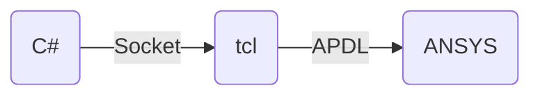
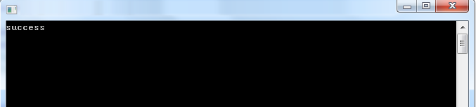
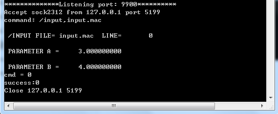

[首页](https://wshwwl.github.io)  [关于](https://wshwwl.github.io/about.html) 

# ANSYS 二次开发初探：C#与tcl程序通过Socket传递命令

[toc]

ANSYS Classic 本身不提供外部应用程序接口，但其自身支持tcl/tk脚本，因此可以在c#与tcl之间通过Socket传递命令，然后再由tcl向ANSYS发送命令，其流程如下：



## 1 tcl服务端

使用以下代码监听9900端口，其回调函数为EchoAccept，一旦有可读数据，调用Echo函数，若识别"/input"命令，则使用ANSYS提供给tcl的“ans_sendcommand”函数，向ANSYS发送命令，并返回命令执行结果。

```tcl

proc Echo_Server {port} {
   global echo
   puts "****************port:$port**********"
   set echo(main) [socket -server EchoAccept $port]
}

proc EchoAccept {sock addr port} {
   global echo
   puts "Accept $sock from $addr port $port"
   set echo(addr,$sock) [list $addr $port]
   fconfigure $sock -buffering line
   fileevent $sock readable [list Echo $sock]
}

proc Echo {sock} {
   global echo
   set len [gets $sock line]
   #puts "length of line is : $len"
   if {[eof $sock] || $len==0} {
      close $sock
      puts "Close $echo(addr,$sock)"
      unset echo(addr,$sock)
   } else {
        if {[string compare $line "quit"] == 0} {
            close $echo(main)
            return
        }
        puts "command: $line"   
        if {[string length $line] > 0} {
            # if it's a input command
            if {[string first "input," $line] >0} {
                set cmd [catch {ans_sendcommand )$line} cmsg]
				puts "cmd = $cmd"
                if {$cmd ==1 } {
                   if {[string first "error" $cmsg] > 0} {
                        puts "exception: $cmsg"
                        puts $sock "error"            
                    } elseif {[string first "warning" $cmsg] > 0 } {
                        puts "exception: $cmsg"
                        puts $sock "warning"            
                    } else {
                        puts "exception: $cmsg"
                      puts $sock "other message"
                    }
               } else {
                    puts "success:$cmsg"
                    puts $sock "success"
                }
            } 
        }
   }
}

if {[catch {Echo_Server 9900}]} {
   if {[catch {Echo_Server 9990}]} {
      Echo_Server 9999
   }   
```

## 2 启动tcl Socket监听服务

在ANSYS里运行上述tcl脚本。若上述脚本保存为server.tcl文件，则运行的方式为在ANSYS命令栏输入：`~tcl,source server.tcl`，启动后，在ANSYS输出窗口可以看到：


表明已经开启socket监听服务，后续可以将该过程的开启设置为自动化的，即随ANSYS启动自动运行该脚本，而无需手动输入。

## 3 C# 通过Socket发送命令并接收结果

由于是同一台计算机上不同程序，C#上tcp客户端请求连接127.0.0.1：9900，发送事先准备好的APDL命令流文件名，然后等待接收返回结果。

```c#
static string sendCommand(string commandFileName)
{
    string resultFlag = string.Empty;
    IPEndPoint remoteEP = new IPEndPoint(IPAddress.Parse("127.0.0.1"), 9900);
    TcpClient newClient = new TcpClient();
    try
    {
        newClient.Connect(remoteEP);
    }
    catch (SocketException)
    {
        return "SocketException";
    }
    NetworkStream nwstream = newClient.GetStream();
    StreamWriter smwriter = new StreamWriter(nwstream, Encoding.ASCII);
    StreamReader smreader = new StreamReader(nwstream, Encoding.ASCII);
    smwriter.WriteLine("/input,"+commandFileName);
    smwriter.Flush();
    Thread thread = new Thread((ThreadStart)delegate
                               {
                                   while (true)
                                   {
                                       if (nwstream.DataAvailable)
                                       {
                                           break;
                                       }
                                       Thread.Sleep(100);
                                   }
                                   resultFlag = smreader.ReadLine();
                                   nwstream.Close();
                                   smreader.Close();
                                   smwriter.Close();
                                   newClient.Close();
                               });
    thread.Name = "GetReturnFlag";
    thread.Start();
    thread.Join();
    thread.Abort();
    while (thread.ThreadState != System.Threading.ThreadState.Aborted)
    {
        Thread.Sleep(100);
    }
    return (resultFlag);
}
```

准备一下APDL文件：

```apdl
#fileName:input.mac
a=3
b=4
```

运行以下代码：

```c#
string commandFileName = "input.mac";
string resultFlag = sendCommand(commandFileName);
Console.WriteLine(resultFlag);
```

得到：



ANSYS输出窗口内容为：

