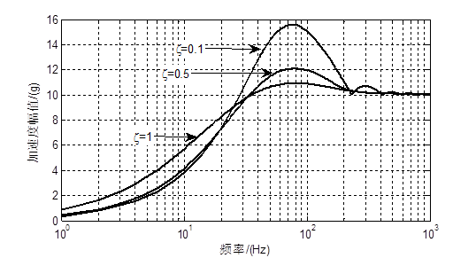

[首页](https://wshwwl.github.io)  [关于](https://wshwwl.github.io/about.html) 

# 隔振设计（三）  隔振系统的冲击反应分析

设计隔振系统的抗冲击性能时，使用的冲击输入是幅值$A=10 g $，宽度$\tau=11ms$ 的半正弦脉冲，即：
$$
\ddot u(t)=
\begin{cases}
Asin(\frac{\pi}{\tau}t)\quad 0\le t \le \tau \\
0 \qquad \qquad \quad t\ge\tau
\end{cases}
$$

在该输入下，系统的反应可根据系统的脉冲反应函数按卷积求解表示为：
$$
x(t)=\int_o^t\ddot u(\tau)h(t-\tau)d\tau \\
\dot x(t)=\int _0^t\ddot u(\tau)\dot h(t-\tau)d\tau\\
\ddot x(t)+\ddot u(t)=\int_0^t\ddot u(\tau)\ddot h(t-\tau)d\tau
$$
其中：
$$
h(t)=-\frac{1}{\omega_d}e^{-h\omega_nt}sin\omega_dt\\
\dot h(t)=-e^{-h\omega_nt}(cos\omega_d-\frac{h}{\sqrt{1-h^2}}sin\omega_dt)\\
\ddot h(t)=\omega_de^{-h\omega_nt}\left[(1-\frac{h^2}{1-h^2})sin\omega_dt+\frac{2h}{\sqrt{1-h^2}}cos\omega_d\right]
$$
分别是位移、速度、加速度脉冲反应函数。在固定的冲击输入下，该响应为系统固有频率与阻尼比的函数。

为考察不同固有频率的隔振系统在该冲击下的峰值响应，采用数值求解方法求解运动方程，得到不同固有频率的隔振系统的绝对加速度响应峰值如图1所示。

图1中，在低频段，系统的固有频率越高，其响应的加速度峰值越大。当系统阻尼比$\zeta=0.1$时，为使系统峰值加速度小于$4g$，其纵向固有频率需低于$10.4Hz$。此外，在低频段，系统阻尼比越大，其加速度反应峰值反而越大，但在$0.1\le\zeta\le0.5$之间时变化并不明显。



<center><b>图1 冲击载荷加速度响应谱</b> </center>

> 附：图1代码

```matlab
clear all;
tau=11/1000;
am=10;
dt=tau/100;
t=0:dt:tau;
T=0:dt:tau*100;
at=am*sin(pi/tau*t);
At=zeros(size(T));
At(1:length(at))=at;

f=logspace(log10(1),log10(1000),100);
h=[0.05,0.1,0.5];
for i=1:length(h)
   rf=tts2(h(i),f,At,dt);
   semilogx(f,rf);
   hold on
end
xlabel('频率/(Hz)');
ylabel('加速度幅值/(g）');
grid on
legend('\zeta='+string(h));
```

