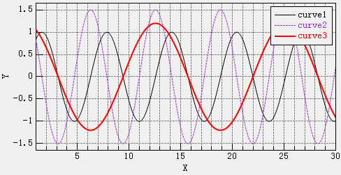

[首页](https://wshwwl.github.io)  [关于](https://wshwwl.github.io/about.html) 

# 曲线绘图控件开发

之前编写的各WinForm程序中使用的曲线绘图控件都是微软的Chart控件，不过在使用的过程中也有些不顺手的地方，而且特别占用内存，只要曲线的 点一多，控件占用的内存指数上升。趁着疫情宅家这段时间，学了点GDI+的东西，慢慢悠悠的自己写了一个控件.现在已经基本满足需求了，虽然功能少了许多，但与之前相比，非常节省内存。

基本内容如下：

* 所有线条元素：自定义线型、线宽、颜色；
* 所有字体元素：自定义字体、大小、颜色；
* 横纵坐标轴标题：自定义字体、自定义边框、内边距；
* 横纵坐标轴：线性/对数显示；刻度线长度；显示/隐藏网格；
* 绘图区：框选放大、拖拽、复原、多条曲线自动上色区分；
* 图例：自动图例、自定义图例、自定义显示位置，自定义内边距